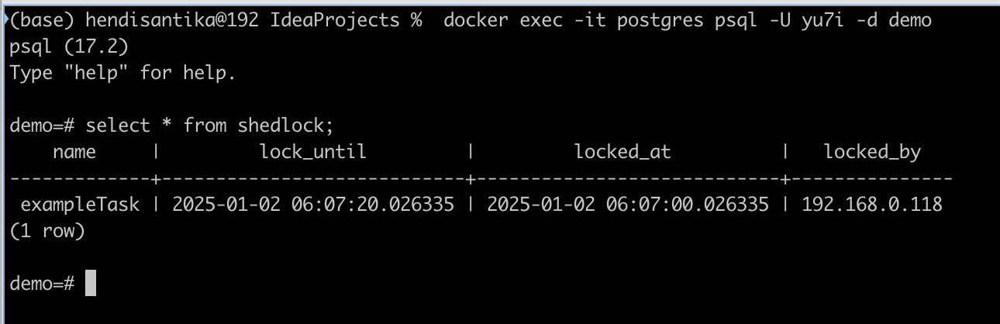

# spring-boot-redis-shedlock-demo

### Things to do list:

1. Clone this repository: `git clone https://github.com/hendisantika/spring-boot-redis-shedlock-demo.git'
2. Go to the folder: `cd spring-boot-redis-shedlock-demo`
3. Run the application: `mvn clean spring-boot:run`
4. Check your terminal/console log
5. Go inside PostgreSQL container: `docker exec -it postgres psql -U yu7i -d demo`
6. Check the data: `select * from shedlock;`

### Images Screen shot

PostgreSQL Console Log



```shell

  .   ____          _            __ _ _
 /\\ / ___'_ __ _ _(_)_ __  __ _ \ \ \ \
( ( )\___ | '_ | '_| | '_ \/ _` | \ \ \ \
 \\/  ___)| |_)| | | | | || (_| |  ) ) ) )
  '  |____| .__|_| |_|_| |_\__, | / / / /
 =========|_|==============|___/=/_/_/_/

 :: Spring Boot ::                (v3.4.1)

2025-01-02T13:05:41.165+07:00  INFO 90677 --- [spring-boot-redis-shedlock-demo] [  restartedMain] r.SpringBootRedisShedlockDemoApplication : Starting SpringBootRedisShedlockDemoApplication using Java 23.0.1 with PID 90677 (/Users/hendisantika/IdeaProjects/spring-boot-redis-shedlock-demo/build/classes/java/main started by hendisantika in /Users/hendisantika/IdeaProjects/spring-boot-redis-shedlock-demo)
2025-01-02T13:05:41.166+07:00  INFO 90677 --- [spring-boot-redis-shedlock-demo] [  restartedMain] r.SpringBootRedisShedlockDemoApplication : No active profile set, falling back to 1 default profile: "default"
2025-01-02T13:05:41.185+07:00  INFO 90677 --- [spring-boot-redis-shedlock-demo] [  restartedMain] .e.DevToolsPropertyDefaultsPostProcessor : Devtools property defaults active! Set 'spring.devtools.add-properties' to 'false' to disable
2025-01-02T13:05:41.185+07:00  INFO 90677 --- [spring-boot-redis-shedlock-demo] [  restartedMain] .e.DevToolsPropertyDefaultsPostProcessor : For additional web related logging consider setting the 'logging.level.web' property to 'DEBUG'
2025-01-02T13:05:41.191+07:00  INFO 90677 --- [spring-boot-redis-shedlock-demo] [  restartedMain] .s.b.d.c.l.DockerComposeLifecycleManager : Using Docker Compose file /Users/hendisantika/IdeaProjects/spring-boot-redis-shedlock-demo/compose.yaml
2025-01-02T13:05:41.584+07:00  INFO 90677 --- [spring-boot-redis-shedlock-demo] [utReader-stderr] o.s.boot.docker.compose.core.DockerCli   :  Container postgres  Creating
2025-01-02T13:05:41.610+07:00  INFO 90677 --- [spring-boot-redis-shedlock-demo] [utReader-stderr] o.s.boot.docker.compose.core.DockerCli   :  Container postgres  Created
2025-01-02T13:05:41.611+07:00  INFO 90677 --- [spring-boot-redis-shedlock-demo] [utReader-stderr] o.s.boot.docker.compose.core.DockerCli   :  Container postgres  Starting
2025-01-02T13:05:41.741+07:00  INFO 90677 --- [spring-boot-redis-shedlock-demo] [utReader-stderr] o.s.boot.docker.compose.core.DockerCli   :  Container postgres  Started
2025-01-02T13:05:41.742+07:00  INFO 90677 --- [spring-boot-redis-shedlock-demo] [utReader-stderr] o.s.boot.docker.compose.core.DockerCli   :  Container postgres  Waiting
2025-01-02T13:05:42.247+07:00  INFO 90677 --- [spring-boot-redis-shedlock-demo] [utReader-stderr] o.s.boot.docker.compose.core.DockerCli   :  Container postgres  Healthy
2025-01-02T13:05:42.783+07:00  INFO 90677 --- [spring-boot-redis-shedlock-demo] [  restartedMain] .s.d.r.c.RepositoryConfigurationDelegate : Bootstrapping Spring Data JPA repositories in DEFAULT mode.
2025-01-02T13:05:42.790+07:00  INFO 90677 --- [spring-boot-redis-shedlock-demo] [  restartedMain] .s.d.r.c.RepositoryConfigurationDelegate : Finished Spring Data repository scanning in 4 ms. Found 0 JPA repository interfaces.
2025-01-02T13:05:42.990+07:00  INFO 90677 --- [spring-boot-redis-shedlock-demo] [  restartedMain] o.s.b.w.embedded.tomcat.TomcatWebServer  : Tomcat initialized with port 8080 (http)
2025-01-02T13:05:42.997+07:00  INFO 90677 --- [spring-boot-redis-shedlock-demo] [  restartedMain] o.apache.catalina.core.StandardService   : Starting service [Tomcat]
2025-01-02T13:05:42.997+07:00  INFO 90677 --- [spring-boot-redis-shedlock-demo] [  restartedMain] o.apache.catalina.core.StandardEngine    : Starting Servlet engine: [Apache Tomcat/10.1.34]
2025-01-02T13:05:43.013+07:00  INFO 90677 --- [spring-boot-redis-shedlock-demo] [  restartedMain] o.a.c.c.C.[Tomcat].[localhost].[/]       : Initializing Spring embedded WebApplicationContext
2025-01-02T13:05:43.014+07:00  INFO 90677 --- [spring-boot-redis-shedlock-demo] [  restartedMain] w.s.c.ServletWebServerApplicationContext : Root WebApplicationContext: initialization completed in 447 ms
2025-01-02T13:05:43.051+07:00 DEBUG 90677 --- [spring-boot-redis-shedlock-demo] [  restartedMain] o.s.jdbc.datasource.DataSourceUtils      : Fetching JDBC Connection from DataSource
2025-01-02T13:05:43.051+07:00  INFO 90677 --- [spring-boot-redis-shedlock-demo] [  restartedMain] com.zaxxer.hikari.HikariDataSource       : HikariPool-1 - Starting...
2025-01-02T13:05:43.123+07:00  INFO 90677 --- [spring-boot-redis-shedlock-demo] [  restartedMain] com.zaxxer.hikari.pool.HikariPool        : HikariPool-1 - Added connection org.postgresql.jdbc.PgConnection@649387ad
2025-01-02T13:05:43.124+07:00  INFO 90677 --- [spring-boot-redis-shedlock-demo] [  restartedMain] com.zaxxer.hikari.HikariDataSource       : HikariPool-1 - Start completed.
2025-01-02T13:05:43.164+07:00  INFO 90677 --- [spring-boot-redis-shedlock-demo] [  restartedMain] o.hibernate.jpa.internal.util.LogHelper  : HHH000204: Processing PersistenceUnitInfo [name: default]
2025-01-02T13:05:43.186+07:00  INFO 90677 --- [spring-boot-redis-shedlock-demo] [  restartedMain] org.hibernate.Version                    : HHH000412: Hibernate ORM core version 6.6.4.Final
2025-01-02T13:05:43.200+07:00  INFO 90677 --- [spring-boot-redis-shedlock-demo] [  restartedMain] o.h.c.internal.RegionFactoryInitiator    : HHH000026: Second-level cache disabled
2025-01-02T13:05:43.314+07:00  INFO 90677 --- [spring-boot-redis-shedlock-demo] [  restartedMain] o.s.o.j.p.SpringPersistenceUnitInfo      : No LoadTimeWeaver setup: ignoring JPA class transformer
2025-01-02T13:05:43.363+07:00  INFO 90677 --- [spring-boot-redis-shedlock-demo] [  restartedMain] org.hibernate.orm.connections.pooling    : HHH10001005: Database info:
	Database JDBC URL [Connecting through datasource 'HikariDataSource (HikariPool-1)']
	Database driver: undefined/unknown
	Database version: 17.2
	Autocommit mode: undefined/unknown
	Isolation level: undefined/unknown
	Minimum pool size: undefined/unknown
	Maximum pool size: undefined/unknown
2025-01-02T13:05:43.497+07:00  INFO 90677 --- [spring-boot-redis-shedlock-demo] [  restartedMain] o.h.e.t.j.p.i.JtaPlatformInitiator       : HHH000489: No JTA platform available (set 'hibernate.transaction.jta.platform' to enable JTA platform integration)
2025-01-02T13:05:43.498+07:00  INFO 90677 --- [spring-boot-redis-shedlock-demo] [  restartedMain] j.LocalContainerEntityManagerFactoryBean : Initialized JPA EntityManagerFactory for persistence unit 'default'
2025-01-02T13:05:43.538+07:00  WARN 90677 --- [spring-boot-redis-shedlock-demo] [  restartedMain] JpaBaseConfiguration$JpaWebConfiguration : spring.jpa.open-in-view is enabled by default. Therefore, database queries may be performed during view rendering. Explicitly configure spring.jpa.open-in-view to disable this warning
2025-01-02T13:05:43.690+07:00  INFO 90677 --- [spring-boot-redis-shedlock-demo] [  restartedMain] o.s.b.d.a.OptionalLiveReloadServer       : LiveReload server is running on port 35729
2025-01-02T13:05:43.706+07:00  INFO 90677 --- [spring-boot-redis-shedlock-demo] [  restartedMain] o.s.b.w.embedded.tomcat.TomcatWebServer  : Tomcat started on port 8080 (http) with context path '/'
2025-01-02T13:05:43.712+07:00  INFO 90677 --- [spring-boot-redis-shedlock-demo] [  restartedMain] r.SpringBootRedisShedlockDemoApplication : Started SpringBootRedisShedlockDemoApplication in 2.691 seconds (process running for 3.016)
2025-01-02T13:06:00.036+07:00 DEBUG 90677 --- [spring-boot-redis-shedlock-demo] [   scheduling-1] o.s.jdbc.datasource.DataSourceUtils      : Fetching JDBC Connection from DataSource
2025-01-02T13:06:00.043+07:00 DEBUG 90677 --- [spring-boot-redis-shedlock-demo] [   scheduling-1] n.j.s.p.j.SqlStatementsSource            : Using PostgresSqlServerTimeStatementsSource
2025-01-02T13:06:00.044+07:00 DEBUG 90677 --- [spring-boot-redis-shedlock-demo] [   scheduling-1] o.s.j.d.DataSourceTransactionManager     : Creating new transaction with name [null]: PROPAGATION_REQUIRES_NEW,ISOLATION_DEFAULT
2025-01-02T13:06:00.045+07:00 DEBUG 90677 --- [spring-boot-redis-shedlock-demo] [   scheduling-1] o.s.j.d.DataSourceTransactionManager     : Acquired Connection [HikariProxyConnection@890160007 wrapping org.postgresql.jdbc.PgConnection@649387ad] for JDBC transaction
2025-01-02T13:06:00.046+07:00 DEBUG 90677 --- [spring-boot-redis-shedlock-demo] [   scheduling-1] o.s.j.d.DataSourceTransactionManager     : Switching JDBC Connection [HikariProxyConnection@890160007 wrapping org.postgresql.jdbc.PgConnection@649387ad] to manual commit
2025-01-02T13:06:00.049+07:00 DEBUG 90677 --- [spring-boot-redis-shedlock-demo] [   scheduling-1] o.s.jdbc.core.JdbcTemplate               : Executing prepared SQL update
2025-01-02T13:06:00.049+07:00 DEBUG 90677 --- [spring-boot-redis-shedlock-demo] [   scheduling-1] o.s.jdbc.core.JdbcTemplate               : Executing prepared SQL statement [INSERT INTO shedlock(name, lock_until, locked_at, locked_by) VALUES(?, timezone('utc', CURRENT_TIMESTAMP) + cast(? as interval), timezone('utc', CURRENT_TIMESTAMP), ?) ON CONFLICT (name) DO UPDATE SET lock_until = timezone('utc', CURRENT_TIMESTAMP) + cast(? as interval), locked_at = timezone('utc', CURRENT_TIMESTAMP), locked_by = ? WHERE shedlock.name = ? AND shedlock.lock_until <= timezone('utc', CURRENT_TIMESTAMP)]
2025-01-02T13:06:00.054+07:00 TRACE 90677 --- [spring-boot-redis-shedlock-demo] [   scheduling-1] o.s.jdbc.core.StatementCreatorUtils      : Setting SQL statement parameter value: column index 1, parameter value [exampleTask], value class [java.lang.String], SQL type unknown
2025-01-02T13:06:00.055+07:00 TRACE 90677 --- [spring-boot-redis-shedlock-demo] [   scheduling-1] o.s.jdbc.core.StatementCreatorUtils      : Setting SQL statement parameter value: column index 2, parameter value [50000 milliseconds], value class [java.lang.String], SQL type unknown
2025-01-02T13:06:00.055+07:00 TRACE 90677 --- [spring-boot-redis-shedlock-demo] [   scheduling-1] o.s.jdbc.core.StatementCreatorUtils      : Setting SQL statement parameter value: column index 3, parameter value [192.168.0.118], value class [java.lang.String], SQL type unknown
2025-01-02T13:06:00.055+07:00 TRACE 90677 --- [spring-boot-redis-shedlock-demo] [   scheduling-1] o.s.jdbc.core.StatementCreatorUtils      : Setting SQL statement parameter value: column index 4, parameter value [50000 milliseconds], value class [java.lang.String], SQL type unknown
2025-01-02T13:06:00.055+07:00 TRACE 90677 --- [spring-boot-redis-shedlock-demo] [   scheduling-1] o.s.jdbc.core.StatementCreatorUtils      : Setting SQL statement parameter value: column index 5, parameter value [192.168.0.118], value class [java.lang.String], SQL type unknown
2025-01-02T13:06:00.055+07:00 TRACE 90677 --- [spring-boot-redis-shedlock-demo] [   scheduling-1] o.s.jdbc.core.StatementCreatorUtils      : Setting SQL statement parameter value: column index 6, parameter value [exampleTask], value class [java.lang.String], SQL type unknown
2025-01-02T13:06:00.066+07:00 TRACE 90677 --- [spring-boot-redis-shedlock-demo] [   scheduling-1] o.s.jdbc.core.JdbcTemplate               : SQL update affected 1 rows
2025-01-02T13:06:00.067+07:00 DEBUG 90677 --- [spring-boot-redis-shedlock-demo] [   scheduling-1] o.s.j.d.DataSourceTransactionManager     : Initiating transaction commit
2025-01-02T13:06:00.067+07:00 DEBUG 90677 --- [spring-boot-redis-shedlock-demo] [   scheduling-1] o.s.j.d.DataSourceTransactionManager     : Committing JDBC transaction on Connection [HikariProxyConnection@890160007 wrapping org.postgresql.jdbc.PgConnection@649387ad]
2025-01-02T13:06:00.069+07:00 DEBUG 90677 --- [spring-boot-redis-shedlock-demo] [   scheduling-1] o.s.j.d.DataSourceTransactionManager     : Releasing JDBC Connection [HikariProxyConnection@890160007 wrapping org.postgresql.jdbc.PgConnection@649387ad] after transaction
2025-01-02T13:06:00.070+07:00 DEBUG 90677 --- [spring-boot-redis-shedlock-demo] [   scheduling-1] n.j.s.core.DefaultLockingTaskExecutor    : Locked 'exampleTask', lock will be held at most until 2025-01-02T06:06:50.033Z
2025-01-02T13:06:00.070+07:00  INFO 90677 --- [spring-boot-redis-shedlock-demo] [   scheduling-1] i.m.h.r.task.ExampleTask                 : task scheduled!
2025-01-02T13:06:15.075+07:00  INFO 90677 --- [spring-boot-redis-shedlock-demo] [   scheduling-1] i.m.h.r.task.ExampleTask                 : task executed!
2025-01-02T13:06:15.078+07:00 DEBUG 90677 --- [spring-boot-redis-shedlock-demo] [   scheduling-1] o.s.j.d.DataSourceTransactionManager     : Creating new transaction with name [null]: PROPAGATION_REQUIRES_NEW,ISOLATION_DEFAULT
2025-01-02T13:06:15.082+07:00 DEBUG 90677 --- [spring-boot-redis-shedlock-demo] [   scheduling-1] o.s.j.d.DataSourceTransactionManager     : Acquired Connection [HikariProxyConnection@836882507 wrapping org.postgresql.jdbc.PgConnection@649387ad] for JDBC transaction
2025-01-02T13:06:15.082+07:00 DEBUG 90677 --- [spring-boot-redis-shedlock-demo] [   scheduling-1] o.s.j.d.DataSourceTransactionManager     : Switching JDBC Connection [HikariProxyConnection@836882507 wrapping org.postgresql.jdbc.PgConnection@649387ad] to manual commit
2025-01-02T13:06:15.083+07:00 DEBUG 90677 --- [spring-boot-redis-shedlock-demo] [   scheduling-1] o.s.jdbc.core.JdbcTemplate               : Executing prepared SQL update
2025-01-02T13:06:15.084+07:00 DEBUG 90677 --- [spring-boot-redis-shedlock-demo] [   scheduling-1] o.s.jdbc.core.JdbcTemplate               : Executing prepared SQL statement [UPDATE shedlock SET lock_until = CASE WHEN locked_at + cast(? as interval) > timezone('utc', CURRENT_TIMESTAMP) THEN locked_at + cast(? as interval) ELSE timezone('utc', CURRENT_TIMESTAMP) END WHERE name = ? AND locked_by = ?]
2025-01-02T13:06:15.084+07:00 TRACE 90677 --- [spring-boot-redis-shedlock-demo] [   scheduling-1] o.s.jdbc.core.StatementCreatorUtils      : Setting SQL statement parameter value: column index 1, parameter value [20000 milliseconds], value class [java.lang.String], SQL type unknown
2025-01-02T13:06:15.084+07:00 TRACE 90677 --- [spring-boot-redis-shedlock-demo] [   scheduling-1] o.s.jdbc.core.StatementCreatorUtils      : Setting SQL statement parameter value: column index 2, parameter value [20000 milliseconds], value class [java.lang.String], SQL type unknown
2025-01-02T13:06:15.084+07:00 TRACE 90677 --- [spring-boot-redis-shedlock-demo] [   scheduling-1] o.s.jdbc.core.StatementCreatorUtils      : Setting SQL statement parameter value: column index 3, parameter value [exampleTask], value class [java.lang.String], SQL type unknown
2025-01-02T13:06:15.084+07:00 TRACE 90677 --- [spring-boot-redis-shedlock-demo] [   scheduling-1] o.s.jdbc.core.StatementCreatorUtils      : Setting SQL statement parameter value: column index 4, parameter value [192.168.0.118], value class [java.lang.String], SQL type unknown
2025-01-02T13:06:15.094+07:00 TRACE 90677 --- [spring-boot-redis-shedlock-demo] [   scheduling-1] o.s.jdbc.core.JdbcTemplate               : SQL update affected 1 rows
2025-01-02T13:06:15.094+07:00 DEBUG 90677 --- [spring-boot-redis-shedlock-demo] [   scheduling-1] o.s.j.d.DataSourceTransactionManager     : Initiating transaction commit
2025-01-02T13:06:15.094+07:00 DEBUG 90677 --- [spring-boot-redis-shedlock-demo] [   scheduling-1] o.s.j.d.DataSourceTransactionManager     : Committing JDBC transaction on Connection [HikariProxyConnection@836882507 wrapping org.postgresql.jdbc.PgConnection@649387ad]
2025-01-02T13:06:15.097+07:00 DEBUG 90677 --- [spring-boot-redis-shedlock-demo] [   scheduling-1] o.s.j.d.DataSourceTransactionManager     : Releasing JDBC Connection [HikariProxyConnection@836882507 wrapping org.postgresql.jdbc.PgConnection@649387ad] after transaction
2025-01-02T13:06:15.097+07:00 DEBUG 90677 --- [spring-boot-redis-shedlock-demo] [   scheduling-1] n.j.s.core.DefaultLockingTaskExecutor    : Task finished, lock 'exampleTask' will be released at 2025-01-02T06:06:20.033Z
2025-01-02T13:07:00.010+07:00 DEBUG 90677 --- [spring-boot-redis-shedlock-demo] [   scheduling-1] o.s.j.d.DataSourceTransactionManager     : Creating new transaction with name [null]: PROPAGATION_REQUIRES_NEW,ISOLATION_DEFAULT
2025-01-02T13:07:00.025+07:00 DEBUG 90677 --- [spring-boot-redis-shedlock-demo] [   scheduling-1] o.s.j.d.DataSourceTransactionManager     : Acquired Connection [HikariProxyConnection@139049959 wrapping org.postgresql.jdbc.PgConnection@649387ad] for JDBC transaction
2025-01-02T13:07:00.026+07:00 DEBUG 90677 --- [spring-boot-redis-shedlock-demo] [   scheduling-1] o.s.j.d.DataSourceTransactionManager     : Switching JDBC Connection [HikariProxyConnection@139049959 wrapping org.postgresql.jdbc.PgConnection@649387ad] to manual commit
2025-01-02T13:07:00.026+07:00 DEBUG 90677 --- [spring-boot-redis-shedlock-demo] [   scheduling-1] o.s.jdbc.core.JdbcTemplate               : Executing prepared SQL update
2025-01-02T13:07:00.026+07:00 DEBUG 90677 --- [spring-boot-redis-shedlock-demo] [   scheduling-1] o.s.jdbc.core.JdbcTemplate               : Executing prepared SQL statement [UPDATE shedlock SET lock_until = timezone('utc', CURRENT_TIMESTAMP) + cast(? as interval), locked_at = timezone('utc', CURRENT_TIMESTAMP), locked_by = ? WHERE shedlock.name = ? AND shedlock.lock_until <= timezone('utc', CURRENT_TIMESTAMP)]
2025-01-02T13:07:00.026+07:00 TRACE 90677 --- [spring-boot-redis-shedlock-demo] [   scheduling-1] o.s.jdbc.core.StatementCreatorUtils      : Setting SQL statement parameter value: column index 1, parameter value [50000 milliseconds], value class [java.lang.String], SQL type unknown
2025-01-02T13:07:00.026+07:00 TRACE 90677 --- [spring-boot-redis-shedlock-demo] [   scheduling-1] o.s.jdbc.core.StatementCreatorUtils      : Setting SQL statement parameter value: column index 2, parameter value [192.168.0.118], value class [java.lang.String], SQL type unknown
2025-01-02T13:07:00.026+07:00 TRACE 90677 --- [spring-boot-redis-shedlock-demo] [   scheduling-1] o.s.jdbc.core.StatementCreatorUtils      : Setting SQL statement parameter value: column index 3, parameter value [exampleTask], value class [java.lang.String], SQL type unknown
2025-01-02T13:07:00.028+07:00 TRACE 90677 --- [spring-boot-redis-shedlock-demo] [   scheduling-1] o.s.jdbc.core.JdbcTemplate               : SQL update affected 1 rows
2025-01-02T13:07:00.028+07:00 DEBUG 90677 --- [spring-boot-redis-shedlock-demo] [   scheduling-1] o.s.j.d.DataSourceTransactionManager     : Initiating transaction commit
2025-01-02T13:07:00.028+07:00 DEBUG 90677 --- [spring-boot-redis-shedlock-demo] [   scheduling-1] o.s.j.d.DataSourceTransactionManager     : Committing JDBC transaction on Connection [HikariProxyConnection@139049959 wrapping org.postgresql.jdbc.PgConnection@649387ad]
2025-01-02T13:07:00.030+07:00 DEBUG 90677 --- [spring-boot-redis-shedlock-demo] [   scheduling-1] o.s.j.d.DataSourceTransactionManager     : Releasing JDBC Connection [HikariProxyConnection@139049959 wrapping org.postgresql.jdbc.PgConnection@649387ad] after transaction
2025-01-02T13:07:00.030+07:00 DEBUG 90677 --- [spring-boot-redis-shedlock-demo] [   scheduling-1] n.j.s.core.DefaultLockingTaskExecutor    : Locked 'exampleTask', lock will be held at most until 2025-01-02T06:07:50.008Z
2025-01-02T13:07:00.030+07:00  INFO 90677 --- [spring-boot-redis-shedlock-demo] [   scheduling-1] i.m.h.r.task.ExampleTask                 : task scheduled!
2025-01-02T13:07:15.035+07:00  INFO 90677 --- [spring-boot-redis-shedlock-demo] [   scheduling-1] i.m.h.r.task.ExampleTask                 : task executed!
2025-01-02T13:07:15.036+07:00 DEBUG 90677 --- [spring-boot-redis-shedlock-demo] [   scheduling-1] o.s.j.d.DataSourceTransactionManager     : Creating new transaction with name [null]: PROPAGATION_REQUIRES_NEW,ISOLATION_DEFAULT
2025-01-02T13:07:15.038+07:00 DEBUG 90677 --- [spring-boot-redis-shedlock-demo] [   scheduling-1] o.s.j.d.DataSourceTransactionManager     : Acquired Connection [HikariProxyConnection@924143917 wrapping org.postgresql.jdbc.PgConnection@649387ad] for JDBC transaction
2025-01-02T13:07:15.038+07:00 DEBUG 90677 --- [spring-boot-redis-shedlock-demo] [   scheduling-1] o.s.j.d.DataSourceTransactionManager     : Switching JDBC Connection [HikariProxyConnection@924143917 wrapping org.postgresql.jdbc.PgConnection@649387ad] to manual commit
2025-01-02T13:07:15.039+07:00 DEBUG 90677 --- [spring-boot-redis-shedlock-demo] [   scheduling-1] o.s.jdbc.core.JdbcTemplate               : Executing prepared SQL update
2025-01-02T13:07:15.039+07:00 DEBUG 90677 --- [spring-boot-redis-shedlock-demo] [   scheduling-1] o.s.jdbc.core.JdbcTemplate               : Executing prepared SQL statement [UPDATE shedlock SET lock_until = CASE WHEN locked_at + cast(? as interval) > timezone('utc', CURRENT_TIMESTAMP) THEN locked_at + cast(? as interval) ELSE timezone('utc', CURRENT_TIMESTAMP) END WHERE name = ? AND locked_by = ?]
2025-01-02T13:07:15.039+07:00 TRACE 90677 --- [spring-boot-redis-shedlock-demo] [   scheduling-1] o.s.jdbc.core.StatementCreatorUtils      : Setting SQL statement parameter value: column index 1, parameter value [20000 milliseconds], value class [java.lang.String], SQL type unknown
2025-01-02T13:07:15.039+07:00 TRACE 90677 --- [spring-boot-redis-shedlock-demo] [   scheduling-1] o.s.jdbc.core.StatementCreatorUtils      : Setting SQL statement parameter value: column index 2, parameter value [20000 milliseconds], value class [java.lang.String], SQL type unknown
2025-01-02T13:07:15.039+07:00 TRACE 90677 --- [spring-boot-redis-shedlock-demo] [   scheduling-1] o.s.jdbc.core.StatementCreatorUtils      : Setting SQL statement parameter value: column index 3, parameter value [exampleTask], value class [java.lang.String], SQL type unknown
2025-01-02T13:07:15.039+07:00 TRACE 90677 --- [spring-boot-redis-shedlock-demo] [   scheduling-1] o.s.jdbc.core.StatementCreatorUtils      : Setting SQL statement parameter value: column index 4, parameter value [192.168.0.118], value class [java.lang.String], SQL type unknown
2025-01-02T13:07:15.042+07:00 TRACE 90677 --- [spring-boot-redis-shedlock-demo] [   scheduling-1] o.s.jdbc.core.JdbcTemplate               : SQL update affected 1 rows
2025-01-02T13:07:15.042+07:00 DEBUG 90677 --- [spring-boot-redis-shedlock-demo] [   scheduling-1] o.s.j.d.DataSourceTransactionManager     : Initiating transaction commit
2025-01-02T13:07:15.042+07:00 DEBUG 90677 --- [spring-boot-redis-shedlock-demo] [   scheduling-1] o.s.j.d.DataSourceTransactionManager     : Committing JDBC transaction on Connection [HikariProxyConnection@924143917 wrapping org.postgresql.jdbc.PgConnection@649387ad]
2025-01-02T13:07:15.045+07:00 DEBUG 90677 --- [spring-boot-redis-shedlock-demo] [   scheduling-1] o.s.j.d.DataSourceTransactionManager     : Releasing JDBC Connection [HikariProxyConnection@924143917 wrapping org.postgresql.jdbc.PgConnection@649387ad] after transaction
2025-01-02T13:07:15.045+07:00 DEBUG 90677 --- [spring-boot-redis-shedlock-demo] [   scheduling-1] n.j.s.core.DefaultLockingTaskExecutor    : Task finished, lock 'exampleTask' will be released at 2025-01-02T06:07:20.008Z
2025-01-02T13:08:00.004+07:00 DEBUG 90677 --- [spring-boot-redis-shedlock-demo] [   scheduling-1] o.s.j.d.DataSourceTransactionManager     : Creating new transaction with name [null]: PROPAGATION_REQUIRES_NEW,ISOLATION_DEFAULT
2025-01-02T13:08:00.011+07:00 DEBUG 90677 --- [spring-boot-redis-shedlock-demo] [   scheduling-1] o.s.j.d.DataSourceTransactionManager     : Acquired Connection [HikariProxyConnection@1951564538 wrapping org.postgresql.jdbc.PgConnection@649387ad] for JDBC transaction
2025-01-02T13:08:00.013+07:00 DEBUG 90677 --- [spring-boot-redis-shedlock-demo] [   scheduling-1] o.s.j.d.DataSourceTransactionManager     : Switching JDBC Connection [HikariProxyConnection@1951564538 wrapping org.postgresql.jdbc.PgConnection@649387ad] to manual commit
2025-01-02T13:08:00.014+07:00 DEBUG 90677 --- [spring-boot-redis-shedlock-demo] [   scheduling-1] o.s.jdbc.core.JdbcTemplate               : Executing prepared SQL update
2025-01-02T13:08:00.014+07:00 DEBUG 90677 --- [spring-boot-redis-shedlock-demo] [   scheduling-1] o.s.jdbc.core.JdbcTemplate               : Executing prepared SQL statement [UPDATE shedlock SET lock_until = timezone('utc', CURRENT_TIMESTAMP) + cast(? as interval), locked_at = timezone('utc', CURRENT_TIMESTAMP), locked_by = ? WHERE shedlock.name = ? AND shedlock.lock_until <= timezone('utc', CURRENT_TIMESTAMP)]
2025-01-02T13:08:00.014+07:00 TRACE 90677 --- [spring-boot-redis-shedlock-demo] [   scheduling-1] o.s.jdbc.core.StatementCreatorUtils      : Setting SQL statement parameter value: column index 1, parameter value [50000 milliseconds], value class [java.lang.String], SQL type unknown
2025-01-02T13:08:00.014+07:00 TRACE 90677 --- [spring-boot-redis-shedlock-demo] [   scheduling-1] o.s.jdbc.core.StatementCreatorUtils      : Setting SQL statement parameter value: column index 2, parameter value [192.168.0.118], value class [java.lang.String], SQL type unknown
2025-01-02T13:08:00.014+07:00 TRACE 90677 --- [spring-boot-redis-shedlock-demo] [   scheduling-1] o.s.jdbc.core.StatementCreatorUtils      : Setting SQL statement parameter value: column index 3, parameter value [exampleTask], value class [java.lang.String], SQL type unknown
2025-01-02T13:08:00.021+07:00 TRACE 90677 --- [spring-boot-redis-shedlock-demo] [   scheduling-1] o.s.jdbc.core.JdbcTemplate               : SQL update affected 1 rows
2025-01-02T13:08:00.021+07:00 DEBUG 90677 --- [spring-boot-redis-shedlock-demo] [   scheduling-1] o.s.j.d.DataSourceTransactionManager     : Initiating transaction commit
2025-01-02T13:08:00.021+07:00 DEBUG 90677 --- [spring-boot-redis-shedlock-demo] [   scheduling-1] o.s.j.d.DataSourceTransactionManager     : Committing JDBC transaction on Connection [HikariProxyConnection@1951564538 wrapping org.postgresql.jdbc.PgConnection@649387ad]
2025-01-02T13:08:00.024+07:00 DEBUG 90677 --- [spring-boot-redis-shedlock-demo] [   scheduling-1] o.s.j.d.DataSourceTransactionManager     : Releasing JDBC Connection [HikariProxyConnection@1951564538 wrapping org.postgresql.jdbc.PgConnection@649387ad] after transaction
2025-01-02T13:08:00.024+07:00 DEBUG 90677 --- [spring-boot-redis-shedlock-demo] [   scheduling-1] n.j.s.core.DefaultLockingTaskExecutor    : Locked 'exampleTask', lock will be held at most until 2025-01-02T06:08:50.004Z
2025-01-02T13:08:00.024+07:00  INFO 90677 --- [spring-boot-redis-shedlock-demo] [   scheduling-1] i.m.h.r.task.ExampleTask                 : task scheduled!
2025-01-02T13:08:15.030+07:00  INFO 90677 --- [spring-boot-redis-shedlock-demo] [   scheduling-1] i.m.h.r.task.ExampleTask                 : task executed!
2025-01-02T13:08:15.030+07:00 DEBUG 90677 --- [spring-boot-redis-shedlock-demo] [   scheduling-1] o.s.j.d.DataSourceTransactionManager     : Creating new transaction with name [null]: PROPAGATION_REQUIRES_NEW,ISOLATION_DEFAULT
2025-01-02T13:08:15.035+07:00 DEBUG 90677 --- [spring-boot-redis-shedlock-demo] [   scheduling-1] o.s.j.d.DataSourceTransactionManager     : Acquired Connection [HikariProxyConnection@1284572848 wrapping org.postgresql.jdbc.PgConnection@649387ad] for JDBC transaction
2025-01-02T13:08:15.036+07:00 DEBUG 90677 --- [spring-boot-redis-shedlock-demo] [   scheduling-1] o.s.j.d.DataSourceTransactionManager     : Switching JDBC Connection [HikariProxyConnection@1284572848 wrapping org.postgresql.jdbc.PgConnection@649387ad] to manual commit
2025-01-02T13:08:15.036+07:00 DEBUG 90677 --- [spring-boot-redis-shedlock-demo] [   scheduling-1] o.s.jdbc.core.JdbcTemplate               : Executing prepared SQL update
2025-01-02T13:08:15.036+07:00 DEBUG 90677 --- [spring-boot-redis-shedlock-demo] [   scheduling-1] o.s.jdbc.core.JdbcTemplate               : Executing prepared SQL statement [UPDATE shedlock SET lock_until = CASE WHEN locked_at + cast(? as interval) > timezone('utc', CURRENT_TIMESTAMP) THEN locked_at + cast(? as interval) ELSE timezone('utc', CURRENT_TIMESTAMP) END WHERE name = ? AND locked_by = ?]
2025-01-02T13:08:15.036+07:00 TRACE 90677 --- [spring-boot-redis-shedlock-demo] [   scheduling-1] o.s.jdbc.core.StatementCreatorUtils      : Setting SQL statement parameter value: column index 1, parameter value [20000 milliseconds], value class [java.lang.String], SQL type unknown
2025-01-02T13:08:15.036+07:00 TRACE 90677 --- [spring-boot-redis-shedlock-demo] [   scheduling-1] o.s.jdbc.core.StatementCreatorUtils      : Setting SQL statement parameter value: column index 2, parameter value [20000 milliseconds], value class [java.lang.String], SQL type unknown
2025-01-02T13:08:15.036+07:00 TRACE 90677 --- [spring-boot-redis-shedlock-demo] [   scheduling-1] o.s.jdbc.core.StatementCreatorUtils      : Setting SQL statement parameter value: column index 3, parameter value [exampleTask], value class [java.lang.String], SQL type unknown
2025-01-02T13:08:15.036+07:00 TRACE 90677 --- [spring-boot-redis-shedlock-demo] [   scheduling-1] o.s.jdbc.core.StatementCreatorUtils      : Setting SQL statement parameter value: column index 4, parameter value [192.168.0.118], value class [java.lang.String], SQL type unknown
2025-01-02T13:08:15.039+07:00 TRACE 90677 --- [spring-boot-redis-shedlock-demo] [   scheduling-1] o.s.jdbc.core.JdbcTemplate               : SQL update affected 1 rows
2025-01-02T13:08:15.039+07:00 DEBUG 90677 --- [spring-boot-redis-shedlock-demo] [   scheduling-1] o.s.j.d.DataSourceTransactionManager     : Initiating transaction commit
2025-01-02T13:08:15.039+07:00 DEBUG 90677 --- [spring-boot-redis-shedlock-demo] [   scheduling-1] o.s.j.d.DataSourceTransactionManager     : Committing JDBC transaction on Connection [HikariProxyConnection@1284572848 wrapping org.postgresql.jdbc.PgConnection@649387ad]
2025-01-02T13:08:15.042+07:00 DEBUG 90677 --- [spring-boot-redis-shedlock-demo] [   scheduling-1] o.s.j.d.DataSourceTransactionManager     : Releasing JDBC Connection [HikariProxyConnection@1284572848 wrapping org.postgresql.jdbc.PgConnection@649387ad] after transaction
2025-01-02T13:08:15.043+07:00 DEBUG 90677 --- [spring-boot-redis-shedlock-demo] [   scheduling-1] n.j.s.core.DefaultLockingTaskExecutor    : Task finished, lock 'exampleTask' will be released at 2025-01-02T06:08:20.004Z
2025-01-02T13:09:00.009+07:00 DEBUG 90677 --- [spring-boot-redis-shedlock-demo] [   scheduling-1] o.s.j.d.DataSourceTransactionManager     : Creating new transaction with name [null]: PROPAGATION_REQUIRES_NEW,ISOLATION_DEFAULT
2025-01-02T13:09:00.013+07:00 DEBUG 90677 --- [spring-boot-redis-shedlock-demo] [   scheduling-1] o.s.j.d.DataSourceTransactionManager     : Acquired Connection [HikariProxyConnection@155322950 wrapping org.postgresql.jdbc.PgConnection@649387ad] for JDBC transaction
2025-01-02T13:09:00.013+07:00 DEBUG 90677 --- [spring-boot-redis-shedlock-demo] [   scheduling-1] o.s.j.d.DataSourceTransactionManager     : Switching JDBC Connection [HikariProxyConnection@155322950 wrapping org.postgresql.jdbc.PgConnection@649387ad] to manual commit
2025-01-02T13:09:00.013+07:00 DEBUG 90677 --- [spring-boot-redis-shedlock-demo] [   scheduling-1] o.s.jdbc.core.JdbcTemplate               : Executing prepared SQL update
2025-01-02T13:09:00.013+07:00 DEBUG 90677 --- [spring-boot-redis-shedlock-demo] [   scheduling-1] o.s.jdbc.core.JdbcTemplate               : Executing prepared SQL statement [UPDATE shedlock SET lock_until = timezone('utc', CURRENT_TIMESTAMP) + cast(? as interval), locked_at = timezone('utc', CURRENT_TIMESTAMP), locked_by = ? WHERE shedlock.name = ? AND shedlock.lock_until <= timezone('utc', CURRENT_TIMESTAMP)]
2025-01-02T13:09:00.014+07:00 TRACE 90677 --- [spring-boot-redis-shedlock-demo] [   scheduling-1] o.s.jdbc.core.StatementCreatorUtils      : Setting SQL statement parameter value: column index 1, parameter value [50000 milliseconds], value class [java.lang.String], SQL type unknown
2025-01-02T13:09:00.014+07:00 TRACE 90677 --- [spring-boot-redis-shedlock-demo] [   scheduling-1] o.s.jdbc.core.StatementCreatorUtils      : Setting SQL statement parameter value: column index 2, parameter value [192.168.0.118], value class [java.lang.String], SQL type unknown
2025-01-02T13:09:00.014+07:00 TRACE 90677 --- [spring-boot-redis-shedlock-demo] [   scheduling-1] o.s.jdbc.core.StatementCreatorUtils      : Setting SQL statement parameter value: column index 3, parameter value [exampleTask], value class [java.lang.String], SQL type unknown
2025-01-02T13:09:00.024+07:00 TRACE 90677 --- [spring-boot-redis-shedlock-demo] [   scheduling-1] o.s.jdbc.core.JdbcTemplate               : SQL update affected 1 rows
2025-01-02T13:09:00.025+07:00 DEBUG 90677 --- [spring-boot-redis-shedlock-demo] [   scheduling-1] o.s.j.d.DataSourceTransactionManager     : Initiating transaction commit
2025-01-02T13:09:00.025+07:00 DEBUG 90677 --- [spring-boot-redis-shedlock-demo] [   scheduling-1] o.s.j.d.DataSourceTransactionManager     : Committing JDBC transaction on Connection [HikariProxyConnection@155322950 wrapping org.postgresql.jdbc.PgConnection@649387ad]
2025-01-02T13:09:00.027+07:00 DEBUG 90677 --- [spring-boot-redis-shedlock-demo] [   scheduling-1] o.s.j.d.DataSourceTransactionManager     : Releasing JDBC Connection [HikariProxyConnection@155322950 wrapping org.postgresql.jdbc.PgConnection@649387ad] after transaction
2025-01-02T13:09:00.028+07:00 DEBUG 90677 --- [spring-boot-redis-shedlock-demo] [   scheduling-1] n.j.s.core.DefaultLockingTaskExecutor    : Locked 'exampleTask', lock will be held at most until 2025-01-02T06:09:50.008Z
2025-01-02T13:09:00.028+07:00  INFO 90677 --- [spring-boot-redis-shedlock-demo] [   scheduling-1] i.m.h.r.task.ExampleTask                 : task scheduled!
2025-01-02T13:09:15.032+07:00  INFO 90677 --- [spring-boot-redis-shedlock-demo] [   scheduling-1] i.m.h.r.task.ExampleTask                 : task executed!
2025-01-02T13:09:15.033+07:00 DEBUG 90677 --- [spring-boot-redis-shedlock-demo] [   scheduling-1] o.s.j.d.DataSourceTransactionManager     : Creating new transaction with name [null]: PROPAGATION_REQUIRES_NEW,ISOLATION_DEFAULT
2025-01-02T13:09:15.039+07:00 DEBUG 90677 --- [spring-boot-redis-shedlock-demo] [   scheduling-1] o.s.j.d.DataSourceTransactionManager     : Acquired Connection [HikariProxyConnection@339983994 wrapping org.postgresql.jdbc.PgConnection@649387ad] for JDBC transaction
2025-01-02T13:09:15.039+07:00 DEBUG 90677 --- [spring-boot-redis-shedlock-demo] [   scheduling-1] o.s.j.d.DataSourceTransactionManager     : Switching JDBC Connection [HikariProxyConnection@339983994 wrapping org.postgresql.jdbc.PgConnection@649387ad] to manual commit
2025-01-02T13:09:15.039+07:00 DEBUG 90677 --- [spring-boot-redis-shedlock-demo] [   scheduling-1] o.s.jdbc.core.JdbcTemplate               : Executing prepared SQL update
2025-01-02T13:09:15.039+07:00 DEBUG 90677 --- [spring-boot-redis-shedlock-demo] [   scheduling-1] o.s.jdbc.core.JdbcTemplate               : Executing prepared SQL statement [UPDATE shedlock SET lock_until = CASE WHEN locked_at + cast(? as interval) > timezone('utc', CURRENT_TIMESTAMP) THEN locked_at + cast(? as interval) ELSE timezone('utc', CURRENT_TIMESTAMP) END WHERE name = ? AND locked_by = ?]
2025-01-02T13:09:15.039+07:00 TRACE 90677 --- [spring-boot-redis-shedlock-demo] [   scheduling-1] o.s.jdbc.core.StatementCreatorUtils      : Setting SQL statement parameter value: column index 1, parameter value [20000 milliseconds], value class [java.lang.String], SQL type unknown
2025-01-02T13:09:15.040+07:00 TRACE 90677 --- [spring-boot-redis-shedlock-demo] [   scheduling-1] o.s.jdbc.core.StatementCreatorUtils      : Setting SQL statement parameter value: column index 2, parameter value [20000 milliseconds], value class [java.lang.String], SQL type unknown
2025-01-02T13:09:15.040+07:00 TRACE 90677 --- [spring-boot-redis-shedlock-demo] [   scheduling-1] o.s.jdbc.core.StatementCreatorUtils      : Setting SQL statement parameter value: column index 3, parameter value [exampleTask], value class [java.lang.String], SQL type unknown
2025-01-02T13:09:15.040+07:00 TRACE 90677 --- [spring-boot-redis-shedlock-demo] [   scheduling-1] o.s.jdbc.core.StatementCreatorUtils      : Setting SQL statement parameter value: column index 4, parameter value [192.168.0.118], value class [java.lang.String], SQL type unknown
2025-01-02T13:09:15.043+07:00 TRACE 90677 --- [spring-boot-redis-shedlock-demo] [   scheduling-1] o.s.jdbc.core.JdbcTemplate               : SQL update affected 1 rows
2025-01-02T13:09:15.043+07:00 DEBUG 90677 --- [spring-boot-redis-shedlock-demo] [   scheduling-1] o.s.j.d.DataSourceTransactionManager     : Initiating transaction commit
2025-01-02T13:09:15.044+07:00 DEBUG 90677 --- [spring-boot-redis-shedlock-demo] [   scheduling-1] o.s.j.d.DataSourceTransactionManager     : Committing JDBC transaction on Connection [HikariProxyConnection@339983994 wrapping org.postgresql.jdbc.PgConnection@649387ad]
2025-01-02T13:09:15.048+07:00 DEBUG 90677 --- [spring-boot-redis-shedlock-demo] [   scheduling-1] o.s.j.d.DataSourceTransactionManager     : Releasing JDBC Connection [HikariProxyConnection@339983994 wrapping org.postgresql.jdbc.PgConnection@649387ad] after transaction
2025-01-02T13:09:15.048+07:00 DEBUG 90677 --- [spring-boot-redis-shedlock-demo] [   scheduling-1] n.j.s.core.DefaultLockingTaskExecutor    : Task finished, lock 'exampleTask' will be released at 2025-01-02T06:09:20.008Z
2025-01-02T13:10:00.010+07:00 DEBUG 90677 --- [spring-boot-redis-shedlock-demo] [   scheduling-1] o.s.j.d.DataSourceTransactionManager     : Creating new transaction with name [null]: PROPAGATION_REQUIRES_NEW,ISOLATION_DEFAULT
2025-01-02T13:10:00.033+07:00 DEBUG 90677 --- [spring-boot-redis-shedlock-demo] [   scheduling-1] o.s.j.d.DataSourceTransactionManager     : Acquired Connection [HikariProxyConnection@1961274202 wrapping org.postgresql.jdbc.PgConnection@649387ad] for JDBC transaction
2025-01-02T13:10:00.033+07:00 DEBUG 90677 --- [spring-boot-redis-shedlock-demo] [   scheduling-1] o.s.j.d.DataSourceTransactionManager     : Switching JDBC Connection [HikariProxyConnection@1961274202 wrapping org.postgresql.jdbc.PgConnection@649387ad] to manual commit
2025-01-02T13:10:00.033+07:00 DEBUG 90677 --- [spring-boot-redis-shedlock-demo] [   scheduling-1] o.s.jdbc.core.JdbcTemplate               : Executing prepared SQL update
2025-01-02T13:10:00.033+07:00 DEBUG 90677 --- [spring-boot-redis-shedlock-demo] [   scheduling-1] o.s.jdbc.core.JdbcTemplate               : Executing prepared SQL statement [UPDATE shedlock SET lock_until = timezone('utc', CURRENT_TIMESTAMP) + cast(? as interval), locked_at = timezone('utc', CURRENT_TIMESTAMP), locked_by = ? WHERE shedlock.name = ? AND shedlock.lock_until <= timezone('utc', CURRENT_TIMESTAMP)]
2025-01-02T13:10:00.034+07:00 TRACE 90677 --- [spring-boot-redis-shedlock-demo] [   scheduling-1] o.s.jdbc.core.StatementCreatorUtils      : Setting SQL statement parameter value: column index 1, parameter value [50000 milliseconds], value class [java.lang.String], SQL type unknown
2025-01-02T13:10:00.034+07:00 TRACE 90677 --- [spring-boot-redis-shedlock-demo] [   scheduling-1] o.s.jdbc.core.StatementCreatorUtils      : Setting SQL statement parameter value: column index 2, parameter value [192.168.0.118], value class [java.lang.String], SQL type unknown
2025-01-02T13:10:00.034+07:00 TRACE 90677 --- [spring-boot-redis-shedlock-demo] [   scheduling-1] o.s.jdbc.core.StatementCreatorUtils      : Setting SQL statement parameter value: column index 3, parameter value [exampleTask], value class [java.lang.String], SQL type unknown
2025-01-02T13:10:00.039+07:00 TRACE 90677 --- [spring-boot-redis-shedlock-demo] [   scheduling-1] o.s.jdbc.core.JdbcTemplate               : SQL update affected 1 rows
2025-01-02T13:10:00.039+07:00 DEBUG 90677 --- [spring-boot-redis-shedlock-demo] [   scheduling-1] o.s.j.d.DataSourceTransactionManager     : Initiating transaction commit
2025-01-02T13:10:00.039+07:00 DEBUG 90677 --- [spring-boot-redis-shedlock-demo] [   scheduling-1] o.s.j.d.DataSourceTransactionManager     : Committing JDBC transaction on Connection [HikariProxyConnection@1961274202 wrapping org.postgresql.jdbc.PgConnection@649387ad]
2025-01-02T13:10:00.040+07:00 DEBUG 90677 --- [spring-boot-redis-shedlock-demo] [   scheduling-1] o.s.j.d.DataSourceTransactionManager     : Releasing JDBC Connection [HikariProxyConnection@1961274202 wrapping org.postgresql.jdbc.PgConnection@649387ad] after transaction
2025-01-02T13:10:00.041+07:00 DEBUG 90677 --- [spring-boot-redis-shedlock-demo] [   scheduling-1] n.j.s.core.DefaultLockingTaskExecutor    : Locked 'exampleTask', lock will be held at most until 2025-01-02T06:10:50.008Z
2025-01-02T13:10:00.041+07:00  INFO 90677 --- [spring-boot-redis-shedlock-demo] [   scheduling-1] i.m.h.r.task.ExampleTask                 : task scheduled!
2025-01-02T13:10:15.046+07:00  INFO 90677 --- [spring-boot-redis-shedlock-demo] [   scheduling-1] i.m.h.r.task.ExampleTask                 : task executed!
2025-01-02T13:10:15.047+07:00 DEBUG 90677 --- [spring-boot-redis-shedlock-demo] [   scheduling-1] o.s.j.d.DataSourceTransactionManager     : Creating new transaction with name [null]: PROPAGATION_REQUIRES_NEW,ISOLATION_DEFAULT
2025-01-02T13:10:15.050+07:00 DEBUG 90677 --- [spring-boot-redis-shedlock-demo] [   scheduling-1] o.s.j.d.DataSourceTransactionManager     : Acquired Connection [HikariProxyConnection@805738480 wrapping org.postgresql.jdbc.PgConnection@649387ad] for JDBC transaction
2025-01-02T13:10:15.050+07:00 DEBUG 90677 --- [spring-boot-redis-shedlock-demo] [   scheduling-1] o.s.j.d.DataSourceTransactionManager     : Switching JDBC Connection [HikariProxyConnection@805738480 wrapping org.postgresql.jdbc.PgConnection@649387ad] to manual commit
2025-01-02T13:10:15.051+07:00 DEBUG 90677 --- [spring-boot-redis-shedlock-demo] [   scheduling-1] o.s.jdbc.core.JdbcTemplate               : Executing prepared SQL update
2025-01-02T13:10:15.051+07:00 DEBUG 90677 --- [spring-boot-redis-shedlock-demo] [   scheduling-1] o.s.jdbc.core.JdbcTemplate               : Executing prepared SQL statement [UPDATE shedlock SET lock_until = CASE WHEN locked_at + cast(? as interval) > timezone('utc', CURRENT_TIMESTAMP) THEN locked_at + cast(? as interval) ELSE timezone('utc', CURRENT_TIMESTAMP) END WHERE name = ? AND locked_by = ?]
2025-01-02T13:10:15.051+07:00 TRACE 90677 --- [spring-boot-redis-shedlock-demo] [   scheduling-1] o.s.jdbc.core.StatementCreatorUtils      : Setting SQL statement parameter value: column index 1, parameter value [20000 milliseconds], value class [java.lang.String], SQL type unknown
2025-01-02T13:10:15.051+07:00 TRACE 90677 --- [spring-boot-redis-shedlock-demo] [   scheduling-1] o.s.jdbc.core.StatementCreatorUtils      : Setting SQL statement parameter value: column index 2, parameter value [20000 milliseconds], value class [java.lang.String], SQL type unknown
2025-01-02T13:10:15.051+07:00 TRACE 90677 --- [spring-boot-redis-shedlock-demo] [   scheduling-1] o.s.jdbc.core.StatementCreatorUtils      : Setting SQL statement parameter value: column index 3, parameter value [exampleTask], value class [java.lang.String], SQL type unknown
2025-01-02T13:10:15.051+07:00 TRACE 90677 --- [spring-boot-redis-shedlock-demo] [   scheduling-1] o.s.jdbc.core.StatementCreatorUtils      : Setting SQL statement parameter value: column index 4, parameter value [192.168.0.118], value class [java.lang.String], SQL type unknown
2025-01-02T13:10:15.056+07:00 TRACE 90677 --- [spring-boot-redis-shedlock-demo] [   scheduling-1] o.s.jdbc.core.JdbcTemplate               : SQL update affected 1 rows
2025-01-02T13:10:15.056+07:00 DEBUG 90677 --- [spring-boot-redis-shedlock-demo] [   scheduling-1] o.s.j.d.DataSourceTransactionManager     : Initiating transaction commit
2025-01-02T13:10:15.056+07:00 DEBUG 90677 --- [spring-boot-redis-shedlock-demo] [   scheduling-1] o.s.j.d.DataSourceTransactionManager     : Committing JDBC transaction on Connection [HikariProxyConnection@805738480 wrapping org.postgresql.jdbc.PgConnection@649387ad]
2025-01-02T13:10:15.060+07:00 DEBUG 90677 --- [spring-boot-redis-shedlock-demo] [   scheduling-1] o.s.j.d.DataSourceTransactionManager     : Releasing JDBC Connection [HikariProxyConnection@805738480 wrapping org.postgresql.jdbc.PgConnection@649387ad] after transaction
2025-01-02T13:10:15.060+07:00 DEBUG 90677 --- [spring-boot-redis-shedlock-demo] [   scheduling-1] n.j.s.core.DefaultLockingTaskExecutor    : Task finished, lock 'exampleTask' will be released at 2025-01-02T06:10:20.008Z

```

